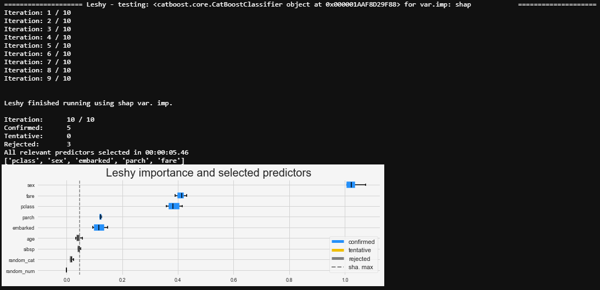
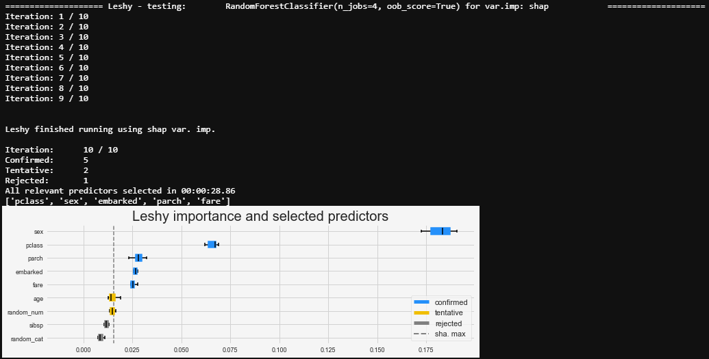
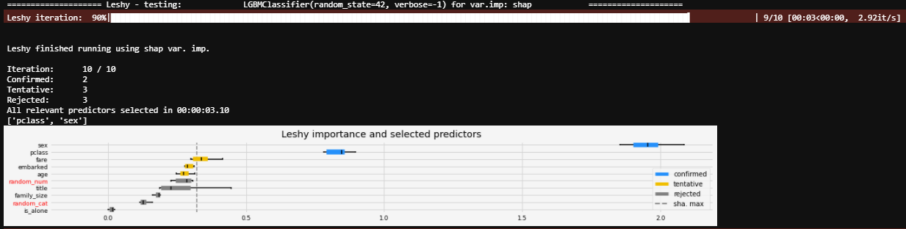
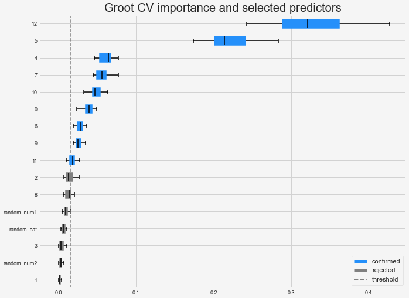
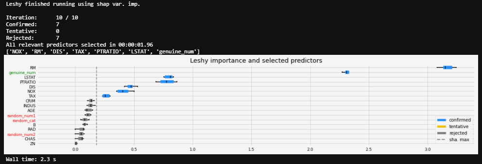
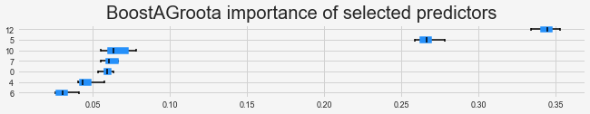

[buy me caffeine](https://ko-fi.com/V7V72SOHX)

# All relevant feature selection

All relevant feature selection means trying to find all features carrying information usable for prediction, rather than finding a possibly compact subset of features on which some particular model has a minimal error. This might include redundant predictors. All relevant feature selection is model agnostic in the sense that it doesn't optimize a scoring function for a *specific* model but rather tries to select all the predictors which are related to the response. 

This package implements 3 different methods (Leshy is an evolution of Boruta, BoostAGroota is an evolution of BoostARoota and GrootCV is a new one). They are sklearn compatible. See hereunder for details about those methods. You can use any sklearn compatible estimator with Leshy and BoostAGroota but I recommend lightGBM. It's fast, accurate and has SHAP values builtin.

Moreover, it provides a module for performing pre-filtering (columns with too many missing values, zero variance, high-cardinality, highly correlated, etc.). Examples and detailled methods hereunder.

## Installation

`$ pip install arfs`

## Example

Working examples for:

 - [Regression](./examples/Regression.ipynb)
 - [Classification](./examples/Classification.ipynb)
 - [Categoricals](./examples/Categoricals.ipynb)
 - [Collinearity](./examples/Collinearity.ipynb)
 - [Pre-filters](./examples/pre-filtering.ipynb)

For imbalanced classification:
 - GrootCV will automatically detect imbalanced data and set the lightGBM `'is_unbalance' = True`
 - For Leshy and BoostAGroota, you can pass the estimator with the relevant parameter (e.g. `class_weight = 'balanced'`)

### All Relevant FS

```python
from sklearn.ensemble import RandomForestRegressor
from catboost import CatBoostRegressor
from xgboost import XGBRegressor
from lightgbm import LGBMRegressor
import matplotlib.pyplot as plt
import seaborn as sns

import arfs
import arfs.featselect as arfsfs
import arfs.allrelevant as arfsgroot
from arfs.utils import LightForestClassifier, LightForestRegressor
from arfs.utils import highlight_tick, compare_varimp
from arfs.utils import load_data, sklearn_pimp_bench
from sklearn.base import clone

boston = load_data(name='Boston')
X, y = boston.data, boston.target
# The arfs methods work with regressors or classifiers
models = [RandomForestRegressor(n_jobs= 4, oob_score= True), 
          CatBoostRegressor(random_state=42, verbose=0), 
          XGBRegressor(random_state=42, verbose=0), 
          LGBMRegressor(random_state=42, verbose=-1),
          LightForestRegressor(n_feat=X.shape[1])]

model = models[3]

# Leshy
feat_selector = arfsgroot.Leshy(model, n_estimators = 100, verbose= 1, max_iter= 10, random_state=42, importance='shap')
feat_selector.fit(X, y, sample_weight=None)
print(feat_selector.support_names_)
fig = feat_selector.plot_importance(n_feat_per_inch=5)
fig = highlight_tick(figure=fig, str_match='random') # highlight synthetic random and genuine variables
fig = highlight_tick(figure=fig, str_match='genuine', color='green')
plt.show()

# BoostAGroota
model = clone(model)
feat_selector = arfsgroot.BoostAGroota(est=model, cutoff=1, iters=10, max_rounds=10, delta=0.1, importance='shap')
feat_selector.fit(X, y, sample_weight=None)
print(feat_selector.support_names_)
fig = feat_selector.plot_importance(n_feat_per_inch=5)
fig = highlight_tick(figure=fig, str_match='random') # highlight synthetic random and genuine variables
fig = highlight_tick(figure=fig, str_match='genuine', color='green')

# GrootCV
feat_selector = arfsgroot.GrootCV(objective='rmse', cutoff = 1, n_folds=5, n_iter=5)
feat_selector.fit(X, y, sample_weight=None)
print(feat_selector.support_names_)
fig = feat_selector.plot_importance(n_feat_per_inch=5)
fig = highlight_tick(figure=fig, str_match='random') # highlight synthetic random and genuine variables
fig = highlight_tick(figure=fig, str_match='genuine', color='green')

plt.show()
```

**Titanic dataset, classification**


<table >
  <tr>
    <td align="left"></td>
    <td align="left"></td>
    <td align="left"></td>
  </tr>
</table>


**Boston dataset, regression** (boostagroota with lightgbm)

<table >
  <tr>
    <td align="left"></td>
    <td align="left"></td>
    <td align="left"></td>
  </tr>
</table>


### Pre-filters

```python
from arfs.utils import _generated_corr_dataset_regr, _generated_corr_dataset_classification

# Artificial data set
X, y, w = _generated_corr_dataset_regr()
data = X.copy()
data['target'] = y

# significant regressors
x_vars = ["var0", "var1", "var2", "var3", "var4"]
y_vars = ["target"]
g = sns.PairGrid(data, x_vars=x_vars, y_vars=y_vars)
g.map(plt.scatter, alpha=0.1)

# noise
x_vars = ["var5", "var6", "var7", "var8", "var9", "var10"]
y_vars = ["target"]
g = sns.PairGrid(data, x_vars=x_vars, y_vars=y_vars)
g.map(plt.scatter, alpha=0.1)

plt.plot()

# X is the predictor DF (e.g: df[predictor_list]), at this stage you don't need to 
# specify the target and weights (only for identifying zero and low importance)
fs = arfsfs.FeatureSelector(X = X, y = y, sample_weight = w)
# filter out missing and store in dic
fs.identify_missing(missing_threshold=0.2)
fsDic = {}
fsDic['missing'] = fs.ops['missing']
fs.plot_missing()

# single unique value columns
fs.identify_single_unique()
fsDic['single_unique'] = fs.ops['single_unique']
fs.plot_unique()

# high cardinality for categoricals predictors
fs.identify_high_cardinality(max_card=2000)
fsDic['high_cardinality'] =  fs.ops['high_cardinality']
fs.plot_cardinality()

# collect columns to drop and force some predictors
cols_to_drop = fs.check_removal()
filtered_features = list( set(X.columns) - set(cols_to_drop) )
X_red = X[filtered_features].copy()
# tagging and keeping track of everything
fs_df = fs.tag_df
fs_df

####################################################
#                                                  #
# Run if you want to remove highly correlated cols #
# and zero/low importance predictors               #
#                                                  #
####################################################

# New instance of the class
fs = arfsfs.FeatureSelector(X = X[filtered_features], y = y, sample_weight = w)
# identify highly correlated columns (here corr_coef >= 0.75)
# set encode to True if there are categorical/string cols (takes a bit of time)
fs.identify_collinear(correlation_threshold=0.5, encode=False)
# tag the discarded predictors and store the results
fs_df = fs_df.merge(fs.tag_df, how='left')
fsDic['collinear'] = sorted(fs.ops['collinear'])
# Plot and save the corr-map
heatmap = fs.plot_collinear(plot_all=True, size=300)
# hv.save(heatmap, "C:User/my_folder/heatmap_corr.html")

fs.encoded = True
fs.identify_zero_importance(task = 'regression', eval_metric = 'rmse', n_iterations = 10, early_stopping = True)
# change the threshold depending if you want to be more conservative and remove more predictors 
cum_imp_threshold = 0.95
fs.identify_low_importance(cumulative_importance = cum_imp_threshold)

fsDic['zero_importance'] = fs.ops['zero_importance']
fsDic['low_importance'] = fs.ops['low_importance']
fs_df = fs_df.merge(fs.tag_df, how='left')
feat_imp = fs.plot_feature_importances(threshold = 0.9, plot_n = 12)
#hv.save(feat_imp, outpath+"feat_imp_TPLMD_freq.html")
feat_imp
```


## Boruta

The Boruta algorithm tries to capture all the important features you might have in your dataset with respect to an outcome variable. The procedure is the following:

 * Create duplicate copies of all independent variables. When the number of independent variables in the original data is less than 5, create at least 5 copies using existing variables.
 * Shuffle the values of added duplicate copies to remove their correlations with the target variable. It is called shadow features or permuted copies.
 * Combine the original ones with shuffled copies
 * Run a random forest classifier on the combined dataset and performs a variable importance measure (the default is Mean Decrease Accuracy) to evaluate the importance of each variable where higher means more important.
 * Then Z score is computed. It means mean of accuracy loss divided by the standard deviation of accuracy loss.
 * Find the maximum Z score among shadow attributes (MZSA)
 * Tag the variables as 'unimportant' when they have importance significantly lower than MZSA. Then we permanently remove them from the process.
 * Tag the variables as 'important' when they have importance significantly higher than MZSA.
 * Repeat the above steps for a predefined number of iterations (random forest runs), or until all attributes are either tagged 'unimportant' or 'important', whichever comes first.

At every iteration, the algorithm compares the Z-scores of the shuffled copies of the features and the original features to see if the latter performed better than the former. If it does, the algorithm will mark the feature as important. In essence, the algorithm is trying to validate the importance of the feature by comparing with randomly shuffled copies, which increases the robustness. This is done by simply comparing the number of times a feature did better with the shadow features using a binomial distribution. Since the whole process is done on the same train-test split, the variance of the variable importance comes only from the different re-fit of the model over the different iterations.


## BoostARoota

BoostARoota follows closely the Boruta method but modifies a few things:

 * One-Hot-Encode the feature set
 * Double width of the data set, making a copy of all features in the original dataset
 * Randomly shuffle the new features created in (2). These duplicated and shuffled features are referred to as "shadow features"
 * Run XGBoost classifier on the entire data set ten times. Running it ten times allows for random noise to be smoothed, resulting in more robust estimates of importance. The number of repeats is a parameter than can be changed.
 * Obtain importance values for each feature. This is a simple importance metric that sums up how many times the particular feature was split on in the XGBoost algorithm.
 * Compute "cutoff": the average feature importance value for all shadow features and divide by four. Shadow importance values are divided by four (parameter can be changed) to make it more difficult for the variables to be removed. With values lower than this, features are removed at too high of a rate.
 * Remove features with average importance across the ten iterations that is less than the cutoff specified in (6)
 * Go back to (2) until the number of features removed is less than ten per cent of the total.
 * Method returns the features remaining once completed.

In the spirit, the same heuristic than Boruta but using Boosting (originally Boruta was supporting only random forest). The validation of the importance is done by comparing to the maximum of the median var. imp of the shadow predictors (in Boruta, a statistical test is performed using the Z-score). Since the whole process is done on the same train-test split, the variance of the variable importance comes only from the different re-fit of the model over the different iterations.

## Modifications to Boruta and BoostARoota

 I forked both Boruta and BoostARoota and made the following changes (under PR):
 
**Boruta --> Leshy**:
 
  - The categorical features (they are detected, encoded. The tree-based models are working better with integer encoding rather than with OHE, which leads to deep and unstable trees). If Catboost is used, then the cat.pred (if any) are set up
  - Using lightGBM as the default speeds up by an order of magnitude the running time
  - Work with Catboost, sklearn API
  - Allow using sample_weight, for applications like Poisson regression or any requiring weights
  - Supports 3 different feature importances: native, SHAP and permutation. Native being the least consistent(because of the imp. biased towards numerical and large cardinality categorical) but the fastest of the 3. Indeed, the impurity var.imp. are biased en sensitive to large cardinality (see [scikit demo](https://scikit-learn.org/stable/auto_examples/inspection/plot_permutation_importance.html#sphx-glr-auto-examples-inspection-plot-permutation-importance-py))
  
**BoostARoota --> BoostAGroota**:

  - Replace XGBoost with LightGBM, you can still use tree-based scikitlearn models
  - Replace native var.imp by SHAP var.imp. Indeed, the impurity var.imp. are biased en sensitive to large cardinality (see [scikit demo](https://scikit-learn.org/stable/auto_examples/inspection/plot_permutation_importance.html#sphx-glr-auto-examples-inspection-plot-permutation-importance-py)). Moreover, the native var. imp are computed on the train set, here the data are split (internally) in train and test, var. imp computed on the test set.
  - Handling categorical predictors. Cat. predictors should NOT be one-hot encoded, it leads to deep unstable trees. Instead, it's better to use the native method of lightGBM or CatBoost. A preprocessing step is needed to encode (ligthGBM and CatBoost use integer encoding and reference to categorical columns. The splitting strategies are different then, see official doc).
  - Work with sample_weight, for Poisson or any application requiring a weighting.

## GrootCV, a new method

**New: GrootCV**:

  - Cross-validated feature importance to smooth out the noise, based on lightGBM only (which is, most of the time, the fastest and more accurate Boosting).
  - the feature importance is derived using SHAP importance
  - Taking the max of the median of the shadow var. imp over folds otherwise not enough conservative and it improves the convergence (needs less evaluation to find a threshold)
  - Not based on a given percentage of cols needed to be deleted
  - Plot method for var. imp
 
 
## References

**Theory**
 - [Consistent feature selection for pattern recognition in polynomial time](http://compmed.se/files/6914/2107/3475/pub_2007_5.pdf)

**Applications**
 - [The Boruta paper](https://www.jstatsoft.org/article/view/v036i11/v36i11.pdf)
 - [The python implementation](https://github.com/scikit-learn-contrib/boruta_py)
 - [BoostARoota](https://github.com/chasedehan/BoostARoota)


## Changes

### 0.1.5

 - fix readme (typos)
 - move utilities in utils sub-package
 - make unit tests lighter

### 0.1.4

 - fix bug when using catboost, clone estimator (avoid error and be sure to use a non-fitted estimator)

### 0.1.3

 - change the defaut for categorical encoding in pre-filters (pd.cat to integers as default)
 - fix the unit tests with new defaults and names

### 0.1.2

 - change arguments name in pre-filters

### 0.1.1

 - remove old attribute names in unit-tests

### 0.1.0

 - Fix lightGBM warnings
 - Typo in repr
 - Provide load_data utility
 - Enhance jupyter NB examples
 - highlighting synthetic random predictors
 - Benchmark using sklearn permutation importance
 - Harmonization of the attributes and parameters
 - Fix categoricals handling

### 0.0.4

 - setting optimal number of features (according to "Elements of statistical learning") when using lightGBM random forest boosting.
 - Providing random forest, lightgbm implementation, estimators

### 0.0.3

 - Adding examples and expanding documentation

### 0.0.2

 - fix bug: relative import removed
